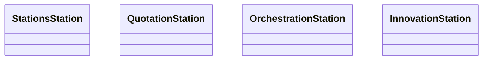

# stations_station

Stations Station is an decentralised autonomous organisaiton built on top of the olas stack.

It is designed to be a 100% agent native organisation built by agent for agents.

By designing agent based services and systems to collaborative within the olas ecosystem, it is provided to help speed development of further projects and provided ideals and inspiration for other devs within the space.


## Service Structure

Services are located in repositories enabling isolated development and deployment.

### Pending Development

- [Stations Stations](https://github.com/StationsStation/stations_station.git): Responsible for defining the core components and templates, acting in a self referential manner. Provides an entry point into the agent native eco-system.

- [Quotation Station](https://github.com/StationsStation/quotation_station.git): Provides an agent based exchange enabling cross chain atomic swaps.

- [Donation Station](https://github.com/StationsStation/donation_station.git): Responsible for providing an agent based solution to analysing and providing a report on the NFT's associated with developing on Olas.

- [Visualisation Station](https://github.com/StationsStation/visualisation_station.git): Responsible for providing templates for the self hosting of agent frontends.

- [Orchestration Station](https://github.com/StationsStation/orchestration_station.git): Responsible for enabling fast, workflow based agents which are able to execute a given workflow. Provides a tooling and agents to automate workflows for organisations using agents. Provides accesss to common archestration tooling and allows agents to execute on remote and local hardware.

- [Capitalisation Station](https://github.com/StationsStation/capitalisation_station.git): Provides Tooling for agent based approach to defi applications.

- [Organisation Station](https://github.com/StationsStation/organisation_station.git): Provides organisational best practices for opinionated web3 development.

- [Experimentation Station](https://github.com/StationsStation/experimentation_station.git): Provides a play-ground for bleeding edge applications of the agent stack.


### Legacy Tooling

- [autonomy-dev](https://github.com/8ball030/auto_dev): cli tooling to aid with development process.

### Hackathons / Pending Migration

- [Liquidation Station](https://github.com:8ball030/liquidation_station.git): Perform onchain liquidations

- [Rysk Roller](https://github.com/8ball030/liquidation_station.git): Implements the wheel strategy against a collection of on-chain assets.

- [Plantation Station](https://github.com/8ball030/plantation_station.git)

- [Innovation Station](https://github.com/8ball030/innovation_station.git)

- [Hydration Station](https://github.com/8ball030): A faucet enabling native top-ups on all supported chains assuming that the requestor has sufficient balance of ve-olas.

- [Collateralisation Station](https://github.com/8ball030/collateralisation_station): in order to make informed decisions on borrowing markets in particular the nfts associated with the collateralisation.


Component dependency graph.





As can be see 


```mermai
flowchart TD

    SetupDSRound -->|DONE|LoadDataRound
    SetupDSRound -->|NOT_DONE|ErrorRound
    SetupDSRound -->|NO_MAJORITY|ErrorRound


    LoadDataRound -->|DONE|ProcessDataRound
    LoadDataRound -->|NOT_DONE|ErrorRound
    LoadDataRound -->|NO_MAJORITY|ErrorRound
    
    ProcessDataRound -->|DONE|VerifyDataRound
    ProcessDataRound -->|NOT_DONE|ErrorRound
    ProcessDataRound -->|NO_MAJORITY|ErrorRound

    VerifyDataRound -->|DONE|CheckClaimableRound
    VerifyDataRound -->|NOT_DONE|ErrorRound
    VerifyDataRound -->|NO_MAJORITY|ErrorRound

    CheckClaimableRound -->|DONE|PrepareClaimTransactionRound
    CheckClaimableRound -->|NOT_DONE|NoClaimRound
    CheckClaimableRound -->|NO_MAJORITY|ErrorRound

    NoClaimRound -->|DONE|CheckDonationRound
    NoClaimRound -->|NOT_DONE|NoClaimRound
    NoClaimRound -->|NO_MAJORITY|ErrorRound

    CheckDonationTransactionRound -->|DONE|PrepareDonationRound
```


## Table of Contents

- [Getting Started](#getting-started)
  - [Installation](#installation)
  - [Setup for Development](#setup-for-development)
- [Usage](#usage)
- [Commands](#commands)
  - [Testing](#testing)
  - [Linting](#linting)
  - [Formatting](#formatting)
  - [Releasing](#releasing)
- [License](#license)

## Getting Started

### Installation and Setup for Development

If you're looking to contribute or develop with `stations_station`, get the source code and set up the environment:

```shell
git clone git@github.com:StationsStation/stations_station.git
cd stations_station
make install
```

## Commands

Here are common commands you might need while working with the project:

### Formatting

```shell
make fmt
```

### Linting

```shell
make lint
```

### Testing

```shell
make test
```

### Locking

```shell
make hashes
```

### all

```shell
make all
```

## License

This project is licensed under the [Apache License 2.0](https://www.apache.org/licenses/LICENSE-2.0)

